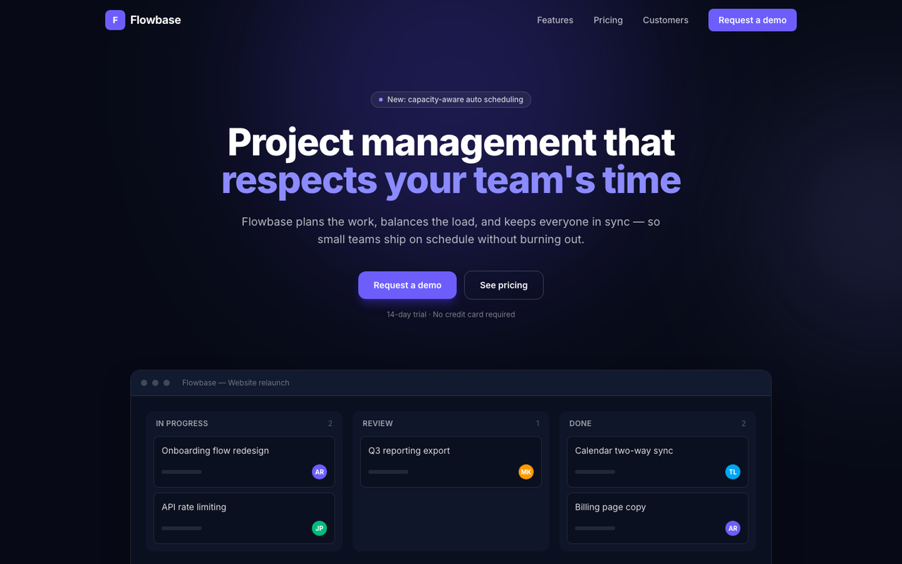
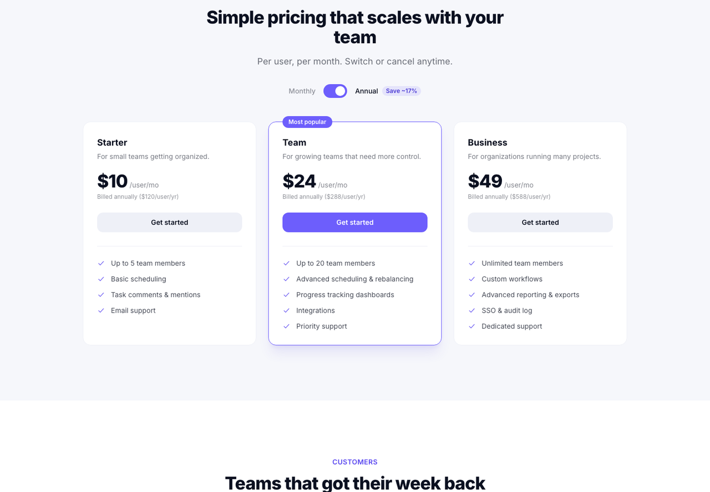
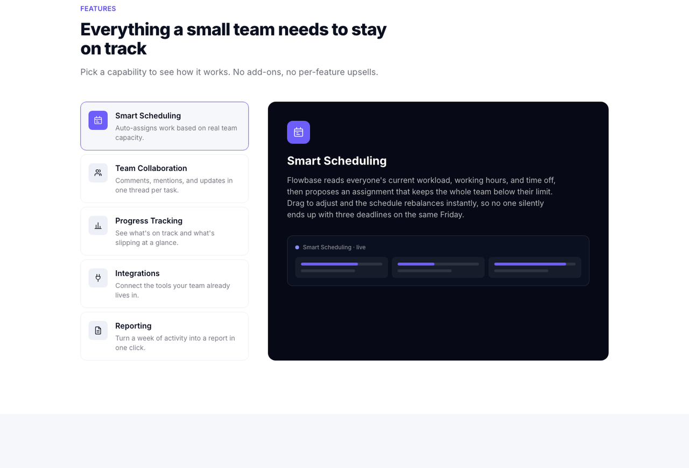
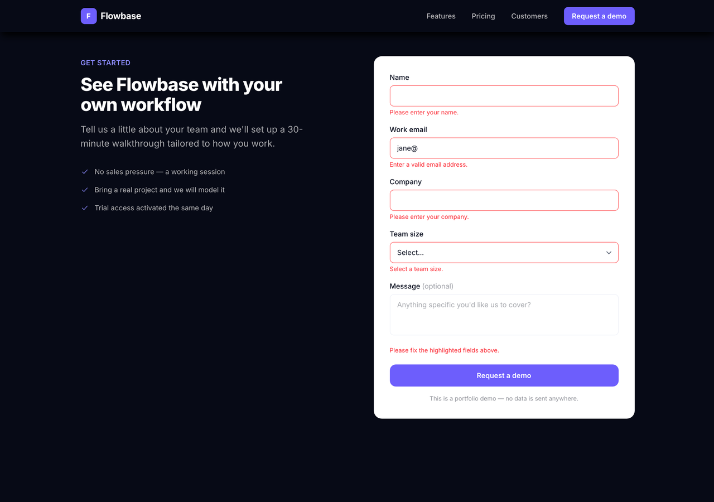
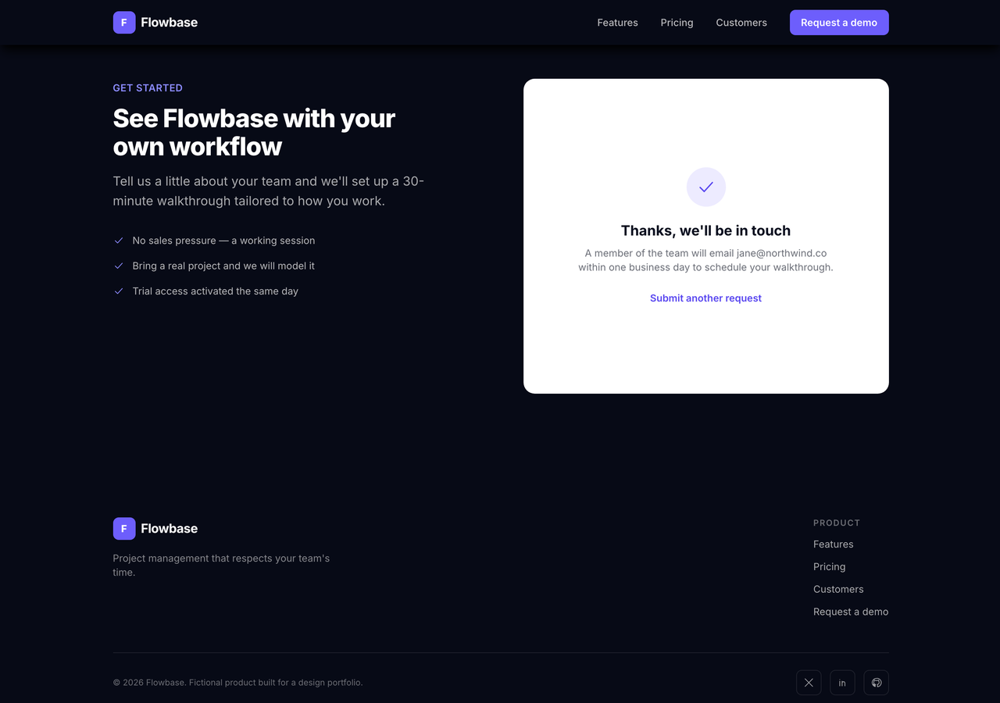

<div align="center">

<h1>⚡ Flowbase</h1>

**Project management that respects your team's time.**

A single-page B2B/SaaS marketing site — built to show SvelteKit fluency and the
stateful pricing / feature / lead-capture patterns real SaaS landing pages live on.

<br />


</div>

<br />



<br />

> [!NOTE]
> **Flowbase is a fictional product.** No real company, customers, or backend — this is
> a portfolio piece. All logos are generic shapes and every testimonial is an original
> placeholder attributed to an invented person.

<br />

## The idea

Portfolio "Site 4" — the piece that adds a **third framework** to the set (SvelteKit,
alongside Astro, Next, and Nuxt elsewhere). SaaS marketing sites are a good showcase for
Svelte specifically: the interactive bits (a billing toggle, feature tabs, an inline-validated
form) are exactly the places where Svelte's built-in reactivity and transitions replace
what would otherwise be Context/Zustand + Framer Motion in React.

So everything interactive here is **framework-native** — `$state`, `$derived`, and
`svelte/transition`. No state library. No animation library.

<br />

## Highlights

<table>
<tr>
<td width="33%" valign="top">

### 🎛️ Reactive pricing

A monthly ⇄ annual switch. All three tier prices recompute the instant it flips —
one `$state` boolean, zero flicker, no effect wiring.

</td>
<td width="33%" valign="top">

### 🗂️ Transitioned feature tabs

Click a capability, the detail panel swaps with a `fly`/`fade` over a stacked
grid cell — so the crossfade never shifts the layout.

</td>
<td width="33%" valign="top">

### ✅ Inline-validated form

Required-field + email-format checks derived straight from form state, gated on
blur/submit, ending in a mock success screen.

</td>
</tr>
</table>

<br />

## Interactive pieces, up close

### Pricing — `PricingTable.svelte`



The entire toggle is one rune. Each card reads the same boolean; Svelte does the rest.

```svelte
let annual = $state(true);

<span class="text-4xl font-extrabold">
  ${annual ? tier.annualPrice : tier.monthlyPrice}
</span>
```

### Feature showcase — `FeatureShowcase.svelte`



`$derived` resolves the active feature; `{#key}` re-runs the transition on change.
Both panels share one grid cell (`[&>*]:[grid-area:1/1]`), so the outgoing and incoming
states overlap instead of stacking — no height jump mid-transition.

```svelte
let activeId = $state(features[0].id);
const active = $derived(features.find((f) => f.id === activeId) ?? features[0]);

{#key active.id}
  <div in:fly={{ y: 12, duration: 320, delay: 90 }} out:fade={{ duration: 90 }}>
    <!-- active feature detail -->
  </div>
{/key}
```

### Demo request form — `DemoForm.svelte`

<table>
<tr>
<td width="50%"></td>
<td width="50%"></td>
</tr>
</table>

Errors are a `$derived` object computed from the current field values — never stored,
always current. Messages stay hidden until a field is blurred or the form is submitted,
then submit focuses the first invalid field.

```svelte
const emailOk = $derived(/^[^\s@]+@[^\s@]+\.[^\s@]+$/.test(form.email.trim()));

const errors = $derived({
  name:  form.name.trim()    ? '' : 'Please enter your name.',
  email: !form.email.trim()  ? 'Please enter your work email.'
        : emailOk             ? '' : 'Enter a valid email address.',
  company:  form.company.trim() ? '' : 'Please enter your company.',
  teamSize: form.teamSize       ? '' : 'Select a team size.'
});

const isValid = $derived(!errors.name && !errors.email && !errors.company && !errors.teamSize);
```

<br />

## Stack

| Layer | Choice | Why |
| --- | --- | --- |
| Framework | **SvelteKit** (Svelte 5, runes) | Third framework in the portfolio; native reactivity is the point |
| Styling | **Tailwind CSS v4** | CSS-first config — theme tokens live in `src/routes/layout.css` via `@theme` |
| State | `$state` / `$derived` | Pricing toggle, feature tabs, form validation — no external library |
| Motion | `svelte/transition` (`fly`, `fade`) | Panel swaps — no animation library |
| Hosting | `@sveltejs/adapter-vercel` | Fully prerendered (`export const prerender = true`) — ships as static assets |
| Type-safety | TypeScript, `svelte-check` | Clean `npm run check` |

<br />

## Quick start

```bash
npm install
npm run dev        # http://localhost:5173
```

```bash
npm run build      # production build via adapter-vercel
npm run preview     # serve the build locally
npm run check       # svelte-check / typecheck
```

<br />

## Structure

```
src/
├─ lib/
│  ├─ components/
│  │  ├─ Nav.svelte              sticky header, scroll-reactive, mobile menu
│  │  ├─ Hero.svelte             headline, dual CTAs, ambient glow
│  │  ├─ DashboardMock.svelte    pure-CSS product screenshot (no image)
│  │  ├─ LogoStrip.svelte        generic fictional wordmarks
│  │  ├─ FeatureShowcase.svelte  tabbed detail panel + transitions
│  │  ├─ PricingTable.svelte     monthly/annual toggle, reactive prices
│  │  ├─ Testimonials.svelte     original placeholder quotes
│  │  ├─ DemoForm.svelte         validation + mock success state
│  │  ├─ Footer.svelte
│  │  └─ Icon.svelte             inline-SVG icon set
│  └─ data/
│     ├─ features.json
│     └─ pricingTiers.json
└─ routes/
   ├─ +layout.svelte            global styles
   ├─ +layout.ts                prerender = true
   └─ +page.svelte              assembles the single-page site
```

<br />

## Design system

Deep-navy sections against clean white, one vivid violet-blue accent for CTAs and
active states. Type is [Inter](https://rsms.me/inter/).

| Token | Hex | Role |
| --- | --- | --- |
|  `ink-950` | `#070A16` | Darkest sections, hero, footer |
|  `ink-900` | `#0B1020` | Body text on white, dark cards |
|  `accent-500` | `#6D5EFC` | Primary CTA, active tab, toggle |
|  `accent-400` | `#8B8BFF` | Accent text on dark |
|  `slatey-50` | `#F6F7FB` | Alternating light section |

<br />

## Deploy

Import the repo in Vercel — the adapter is already wired, no build settings to fill in.
The site is 100% prerendered, so it serves as static assets on the edge.

<br />

## Status

Complete as a portfolio piece. May return later for further development — no active roadmap.

<div align="center"><sub>Built with SvelteKit · Fictional product · Portfolio demo</sub></div>
